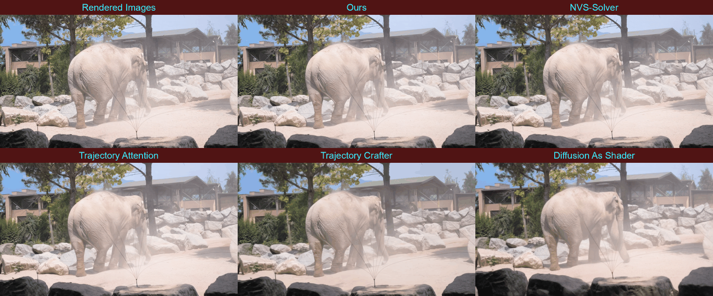
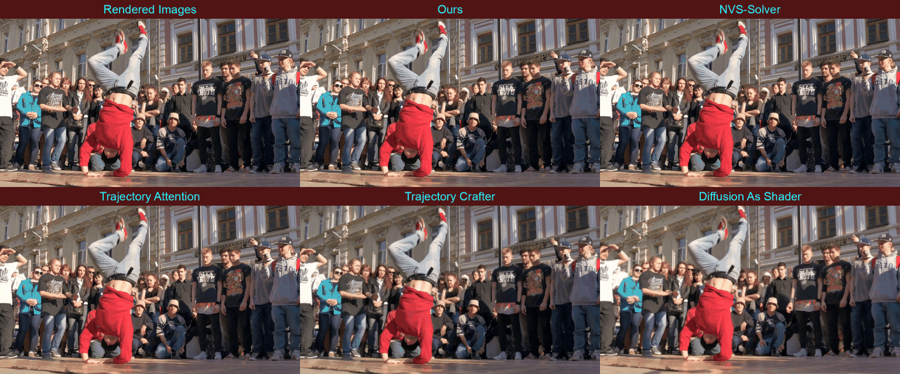

# Prioritizing Faithfulness: Efficient Zero-Shot Novel View Synthesis with Adaptive Latent Modulation




## Installation

1. Create a conda environment
    - MAKE SURE to install xformers here.
    - Change the CUDA version in the `--index-url` based on your environment.
    ```bash
    conda create -n faithful_nvs python=3.12
    conda activate faithful_nvs
    conda install conda-forge::imagemagick
    conda install conda-forge::ffmpeg
    pip3 install torch torchvision xformers --index-url https://download.pytorch.org/whl/cu126
    MAX_JOBS=4 pip3 install flash-attn --no-build-isolation
    ```

2. Clone the repository
    ```bash
    git clone --recursive https://github.com/kakukakujirori/FaithfulNVS.git
    cd FaithfulNVS
    bash patch/apply_patch.sh  # apply patch to submodules
    pip3 install -r requirements.txt
    ```

3. Download model weights
    ```bash
    mkdir checkpoints

    # Depth Anything V2
    wget https://huggingface.co/depth-anything/Depth-Anything-V2-Large/resolve/main/depth_anything_v2_vitl.pth?download=true
    mv depth_anything_v2_vitl.pth\?download\=true checkpoints/depth_anything_v2_vitl.pth

    # Video Depth Anything
    wget https://huggingface.co/depth-anything/Video-Depth-Anything-Large/resolve/main/video_depth_anything_vitl.pth
    mv video_depth_anything_vitl.pth checkpoints/video_depth_anything_vitl.pth

    # # Trajectory Attention (only for evaluation comparison)
    # wget https://huggingface.co/zeqixiao/TrajectoryAttention/resolve/main/trajattn_temp.pth?download=true
    # mv trajattn_temp.pth\?download\=true checkpoints/trajattn_temp.pth

    # # Diffusion As Shader (only for evaluation comparison)
    # git clone https://huggingface.co/EXCAI/Diffusion-As-Shader checkpoints/Diffusion-As-Shader
    ```

## Run

```bash
# image input
bash image_control.sh

# video input
bash video_control.sh
```
You will find the results in the ```output``` folder.

Configurations (Modify the variables in the files):
- `CAMERA_MOTION_MODE`: Camera motion (`horizontal`, `vertical`, or `zoomout`)
- `DEGREE`: Camera motion amount
- `MODEL`: Video diffusion model for inpainting (`SVD` or `WAN`)

## Evaluation

### Preparation

Make sure you have [colmap](https://colmap.github.io/install.html) and [glomap](https://github.com/colmap/glomap) installed in your environment.

You also need to install additional dependencies:
```bash
conda activate faithful_nvs
pip3 install git+https://github.com/ByteDance-Seed/Depth-Anything-3.git
pip3 install --no-build-isolation git+https://github.com/mohammadasim98/met3r
pip3 install --no-build-isolation ./tools/FVD/fvdcal-1.0-py3-none-any.whl
```

### Directory Structure

Download the respective datasets. We assume the following data structure:

```bash
$(DATA_ROOT)
├── DAVIS
│   ├── Annotations
│   │   └── Full-Resolution
│   ├── ImageSets
│   │   ├── 2016
│   │   └── 2017
│   └── JPEGImages
│       └── Full-Resolution
│
├── TanksAndTemples
│   ├── Auditorium
│   ├── Ballroom
│   └── ......
│
├── MannequinChallenge
│   ├── test
│   ├── train
│   └── validation
│       ├── 00c9878266685887.txt
│       ├── 0370e2174d04548b.txt
│       └── ......
│
└── DL3DV-Evaluation
    ├── images
    │       ├── 02267...bb1be/
    │       ├── 0238d...f544e/
    │       └── ......
    └── ......
```

### 1. Image-to-Video: Scripted Camera Motion (DAVIS & Tanks)

```bash
python eval_dataset_i2v_scripted_cam.py [davis/tanks] --data_root ${DATA_ROOT} --method XXX --use_mesh [--scratch]
```

- `--method` : which inpainting method to use (`faithful_svd`, `faithful_wan`, `trajcrafter`, `trajattn`, `nvssolver`, `das`, `vace`)
- `--use_mesh` : If set, mesh-based rendering is used. If not, NVS-Solver's bilinear splatting is used. We recommend adding this flag.
- `--scratch` : Set when you run the evaluation for the first time. If not set, the code assumes that rendering has already completed and its results are stored in a particular folder.

Tips: You may want to change the `GPUS` and `MAX_WORKER_NUM` for multiprocessing at the top of `eval_dataset_i2v_scripted_cam.py`.

### 2. Image-to-Video: Real Camera Motion (Mannequin & DL3DV-Eval)

[TODO: provide `download_extract.py` (The following works only after you run `download_extract.py` and download all the videos).]

Then run the following:
```bash
python eval_dataset_i2v_real_cam.py [mannequin/dl3dv_half] --data_root ${DATA_ROOT} --method XXX --use_mesh [--scratch]
```

### 3. Video-to-Video: Scripted Camera Motion (DAVIS)

```bash
python eval_dataset_v2v_scripted_cam.py davis --data_root ${DATA_ROOT} --method XXX --use_mesh [--scratch]
```

NOTE: For video-to-video evaluation, we use [ViPE](https://github.com/nv-tlabs/vipe/tree/main) for camera pose estimation. Since its requiring library versions are stricter than us, we recommend re-creating a virtual environment based on the ViPE instrallation process under `./tools/vipe`.